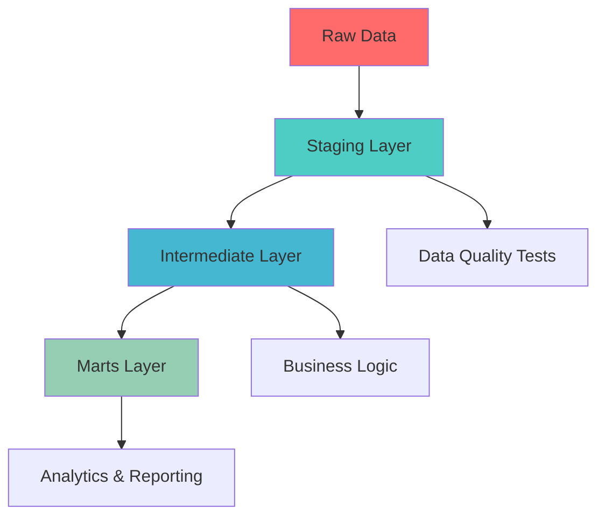

# 🎫 B2B Ticket Sales Analytics DBT Project

<div align="center">


**Transform raw ticket sales data into actionable business insights**

[🚀 Quick Start](#quick-start) • [📊 Models](#models) • [🔍 Data Quality](#data-quality) • [📈 Analytics](#analytics)

</div>

---

## 🌟 Overview

This DBT project transforms raw B2B ticket sales data into a comprehensive analytics platform, providing insights into:

- 💰 **Revenue Performance** - Track sales trends and forecasts
- 👥 **Customer Behavior** - Understand buying patterns and segments  
- 🏆 **Seller Performance** - Identify top performers and areas for improvement
- 🎭 **Event Analytics** - Measure event success and popularity
- 📊 **Cohort Analysis** - Track customer retention over time

## 🏗️ Architecture



### 📁 Project Structure

```
models/
├── 📂 staging/           # Clean & standardize raw data
│   ├── sources.yml       # Source definitions
│   └── stg_ticket_sales.sql
├── 📂 intermediate/      # Business logic & calculations
│   ├── int_sales_metrics.sql
│   └── int_customer_aggregates.sql
└── 📂 marts/            # Final analytical models
    ├── 📂 sales_performance/
    │   └── daily_sales_summary.sql
    ├── 📂 seller_performance/  
    │   └── seller_leaderboard.sql
    └── 📂 analytics/
        ├── event_performance.sql
        ├── cohort_analysis.sql
        └── data_quality_summary.sql
```

## 🚀 Quick Start

### Prerequisites
- DBT Core installed (`pip install dbt-snowflake`)
- Snowflake connection configured
- Access to `B2B_SALES.B2B_SALES.TICKET_SALES_RAW` table

### Setup
```bash
# Clone and navigate to project
git clone <your-repo>
cd b2b-ticket-sales-dbt

# Install dependencies
dbt deps

# Test connection
dbt debug

# Run models
dbt run

# Run tests
dbt test

# Generate docs
dbt docs generate && dbt docs serve
```

## 📊 Models

### 🔧 Staging Layer (`staging/`)

#### `stg_ticket_sales`
> **Purpose**: Clean and standardize raw ticket sales data

**Key Features**:
- ✅ Data cleaning (trim, standardize names)
- 🚨 Data quality flags for invalid records
- 📅 Date parsing and formatting
- 🧹 Null handling and validation

**Sample Output**:
| transaction_id | customer_name | total_amount | is_invalid_amount |
|----------------|---------------|--------------|-------------------|
| 12345         | JOHN DOE      | 150.00       | FALSE            |

---

### ⚙️ Intermediate Layer (`intermediate/`)

#### `int_sales_metrics`
> **Purpose**: Add business calculations and derived metrics

**Key Features**:
- 💵 Average price per ticket calculation
- 📊 Revenue tier categorization  
- 🏢 Bulk purchase identification
- 📅 Time dimension extractions

#### `int_customer_aggregates`
> **Purpose**: Customer-level aggregations and segmentation

**Key Features**:
- 🛒 Purchase history summaries
- 👤 Customer lifetime value
- 🏷️ Automated customer segmentation
- 📈 Behavioral metrics

---

### 🎯 Marts Layer (`marts/`)

#### Sales Performance
| Model | Description | Key Metrics |
|-------|-------------|-------------|
| `daily_sales_summary` | Daily sales performance | Revenue, Transactions, Avg Deal Size |

#### Seller Performance  
| Model | Description | Key Metrics |
|-------|-------------|-------------|
| `seller_leaderboard` | Seller rankings & performance | Revenue Rank, Sales Count, Performance Tier |

#### Analytics
| Model | Description | Use Case |
|-------|-------------|----------|
| `event_performance` | Event success metrics | Event ROI, Popularity Analysis |
| `cohort_analysis` | Customer retention tracking | Retention Rates, Revenue Cohorts |

## 🔍 Data Quality

### Automated Testing
- ✅ **Uniqueness**: Transaction IDs, Primary Keys
- ✅ **Not Null**: Critical business fields  
- ✅ **Range Validation**: Amounts, Quantities
- ✅ **Accepted Values**: Categories, Enums
- ✅ **Freshness**: Data recency checks

### Quality Metrics Dashboard
The `data_quality_summary` model provides:
- 📊 Completeness rates by field
- 🚨 Invalid record counts  
- 📈 Data quality trends over time

## 📈 Analytics Use Cases

### 🎯 Business Questions Answered

<details>
<summary><strong>📊 Revenue Analysis</strong></summary>

- Which months have the highest sales?
- What's our average deal size by seller type?
- How does revenue vary by sales channel?
- Which events generate the most revenue?

**Key Models**: `daily_sales_summary`, `event_performance`
</details>

<details>
<summary><strong>👥 Customer Insights</strong></summary>

- Who are our VIP customers?
- What's our customer retention rate?
- How do buying patterns change over time?
- Which customers are at risk of churning?

**Key Models**: `int_customer_aggregates`, `cohort_analysis`
</details>

<details>
<summary><strong>🏆 Sales Performance</strong></summary>

- Who are our top-performing sellers?
- Which office locations perform best?
- How do sellers compare across different metrics?
- What drives high-value transactions?

**Key Models**: `seller_leaderboard`, `daily_sales_summary`
</details>

### 📊 Sample Insights

> 💡 **Top Insight**: Premium customers (>$1000 transactions) represent only 5% of transactions but generate 35% of total revenue

> 📈 **Growth Opportunity**: Online sales channel shows 40% higher average deal size than phone sales

> 🎯 **Performance Leader**: Sellers in NYC office have 25% higher conversion rates than company average

## 🛠️ Advanced Features

### 🔄 Incremental Processing
```sql
-- Example incremental model configuration
{{ config(
    materialized='incremental',
    unique_key='transaction_id',
    on_schema_change='fail'
) }}
```

### 📏 Custom Macros
- `calculate_revenue_tier()` - Standardized revenue categorization
- `customer_segmentation()` - Reusable customer classification logic
- `time_grain_rollup()` - Flexible time period aggregations

### 🧪 Testing Strategy
- **Unit Tests**: Individual model logic validation
- **Integration Tests**: Cross-model relationship checks  
- **Data Quality Tests**: Automated anomaly detection
- **Business Rule Tests**: Custom business logic validation

## 🚀 Deployment

### Development Workflow
```bash
# Feature development
dbt run --select +my_new_model+

# Testing
dbt test --select my_new_model

# Documentation
dbt docs generate
```

### Production Deployment
- 🔄 **CI/CD Pipeline**: Automated testing and deployment
- 📊 **Monitoring**: Data freshness and quality alerts
- 📈 **Performance**: Query optimization and materialization strategies
- 🔐 **Security**: Row-level security and data masking

## 📚 Resources

- 📖 [DBT Documentation](https://docs.getdbt.com/)
- 🎥 [DBT Learn](https://learn.getdbt.com/)
- 💬 [DBT Community](https://community.getdbt.com/)
- ❄️ [Snowflake + DBT Best Practices](https://docs.snowflake.com/en/user-guide/ecosystem-dbt.html)

## 🤝 Contributing

1. **Fork** the repository
2. **Create** a feature branch (`git checkout -b feature/amazing-analysis`)
3. **Test** your changes (`dbt test`)
4. **Commit** your changes (`git commit -m 'Add amazing analysis'`)
5. **Push** to the branch (`git push origin feature/amazing-analysis`)
6. **Open** a Pull Request

## 📋 Changelog

### v1.0.0 (Latest)
- ✅ Initial project setup
- ✅ Core staging and intermediate models
- ✅ Sales performance marts
- ✅ Customer analytics
- ✅ Data quality framework

---

<div align="center">

**Built with ❤️ using DBT and Snowflake**

[⭐ Star this repo](https://github.com/your-repo) • [🐛 Report Bug](https://github.com/your-repo/issues) • [💡 Request Feature](https://github.com/your-repo/issues)

</div>
